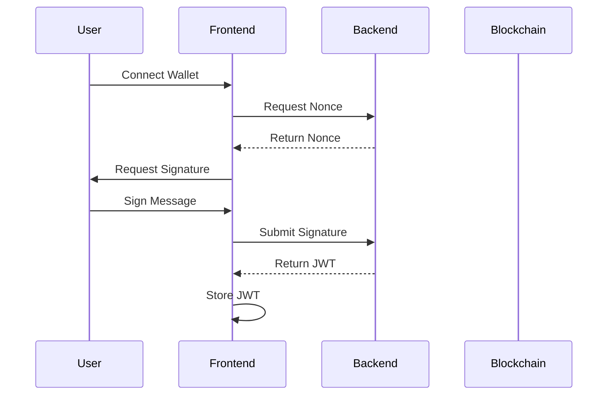
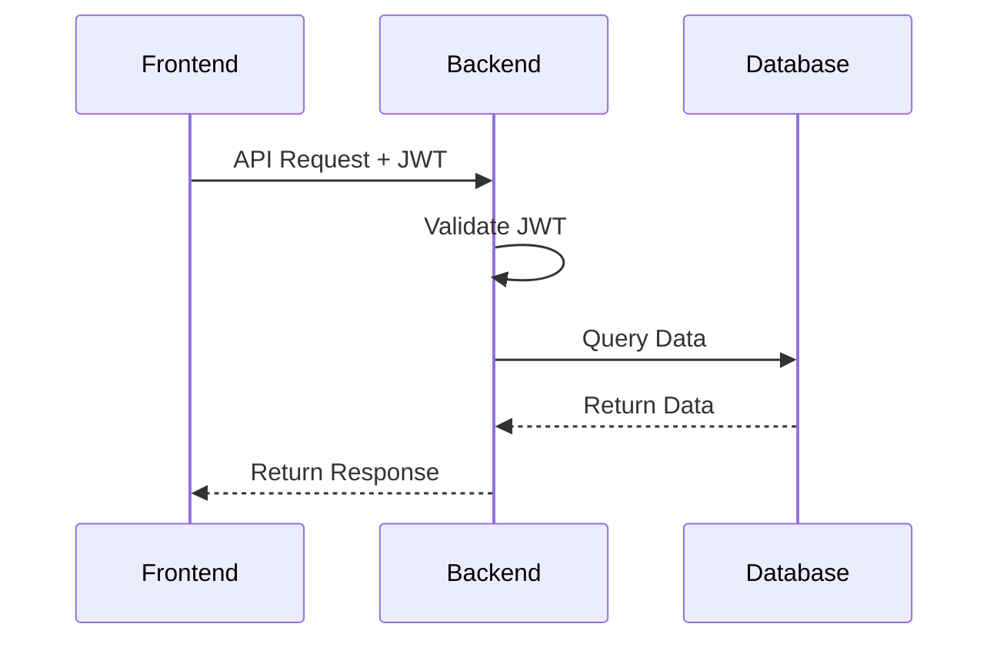
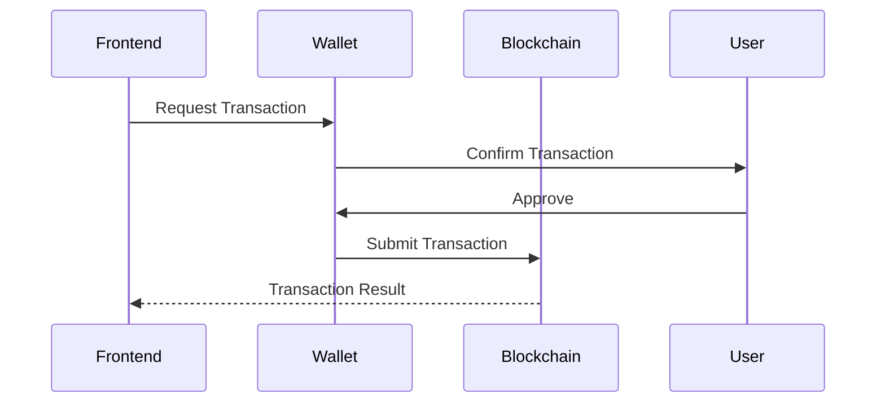

# Web3 Authentication Architecture

## Overview

This application uses a **hybrid authentication model** that combines JWT tokens for backend API access with direct wallet signing for blockchain transactions. This provides the best of both worlds: efficient backend operations and true decentralization.

## Authentication Types

### 1. JWT Authentication (Backend Access)
- **Purpose**: Access user-specific data and backend services
- **When**: Reading personal data, analytics, preferences, rate limiting
- **How**: One-time wallet signature creates a JWT token
- **Benefits**: 
  - No wallet popup for every API call
  - Enables caching and optimization
  - Better UX for data operations
  - Spam/rate limiting protection

### 2. Wallet Signing (Blockchain Transactions)
- **Purpose**: All blockchain interactions
- **When**: Creating resources, buying access, withdrawing funds
- **How**: Direct wallet signature for each transaction
- **Benefits**:
  - True decentralization
  - User controls every transaction
  - No single point of failure
  - Transparent and verifiable

## Implementation Flow

### Initial Authentication Flow


### Backend API Flow (Using JWT)


### Blockchain Transaction Flow (Using Wallet)


## When to Use Each Method

| Operation | Authentication | Reason |
|-----------|----------------|---------|
| Create Resource | Wallet Signature | Blockchain transaction |
| Buy Access | Wallet Signature | Blockchain transaction |
| Withdraw Funds | Wallet Signature | Blockchain transaction |
| View My Resources | JWT Token | Backend data query |
| View My Purchases | JWT Token | Backend data query |
| Update Metadata | JWT Token | Backend operation |
| Rate Limiting | JWT Token | Backend protection |
| Analytics | JWT Token | Backend tracking |

## Security Considerations

### JWT Security
- **Expiration**: Tokens expire after 24 hours (configurable)
- **Storage**: Stored in localStorage (consider httpOnly cookies for production)
- **Validation**: Server validates signature and expiry on each request
- **Invalidation**: Tokens are invalidated on logout

### Wallet Security
- **User Control**: Users must approve each transaction
- **No Private Keys**: Application never handles private keys
- **Transparent**: All transactions are visible on blockchain
- **Reversible**: Users can reject transactions

## Code Examples

### Setting Up Authentication
```typescript
// Wrap your app with the AuthProvider
<AuthProvider>
  <WagmiProvider>
    <App />
  </WagmiProvider>
</AuthProvider>
```

### Using JWT for Backend Calls
```typescript
const { fetchWithAuth } = useBackendApi();

// This uses JWT automatically
const myResources = await fetchWithAuth('/api/user/resources');
```

### Using Wallet for Transactions
```typescript
const { createResource } = useContractActions();

// This prompts wallet signature
await createResource({
  name: 'My Resource',
  price: '0.1', // ETH
  // ... other params
});
```

## Benefits of This Approach

### For Users
✅ **Better UX**: No wallet popup for reading data  
✅ **Full Control**: Must approve all transactions  
✅ **Privacy**: Can disconnect backend access separately  
✅ **Transparency**: All transactions are public  

### For Developers
✅ **Efficiency**: Backend operations are fast  
✅ **Security**: JWT prevents unauthorized access  
✅ **Scalability**: Can cache and optimize backend calls  
✅ **Flexibility**: Can add features without blockchain changes  

### For the Ecosystem
✅ **Decentralization**: Critical operations use blockchain  
✅ **Interoperability**: Standard wallet interfaces  
✅ **Composability**: Other dApps can interact with contract  
✅ **Transparency**: All transactions are auditable  

## Migration Strategy

If you're coming from a purely backend-authenticated system:

1. **Phase 1**: Add wallet connection (no auth required)
2. **Phase 2**: Add JWT authentication for backend APIs
3. **Phase 3**: Move critical operations to blockchain
4. **Phase 4**: Remove backend authentication for transaction operations

## Environment Variables

```bash
# JWT Configuration
JWT_SECRET=your-secret-key
JWT_EXPIRY=24h

# Blockchain Configuration
NEXT_PUBLIC_CONTRACT_ADDRESS=0x...
NEXT_PUBLIC_RPC_URL=https://...
```

## Best Practices

1. **Always use wallet signing for:**
   - Money transfers
   - Creating/modifying resources
   - Any state changes on blockchain

2. **Use JWT authentication for:**
   - Reading user-specific data
   - Analytics and metrics
   - Backend-only operations
   - Rate limiting

3. **Security guidelines:**
   - Validate JWT on every backend request
   - Use HTTPS in production
   - Consider httpOnly cookies for JWT storage
   - Implement proper CORS policies
   - Add rate limiting to prevent abuse

4. **UX guidelines:**
   - Show clear indicators of authentication status
   - Explain why wallet signatures are needed
   - Provide fallbacks when authentication fails
   - Cache backend data to reduce API calls
